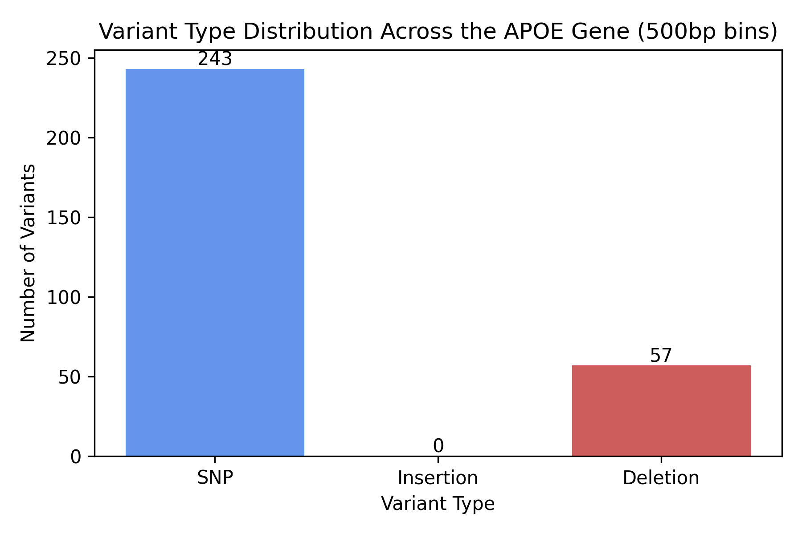
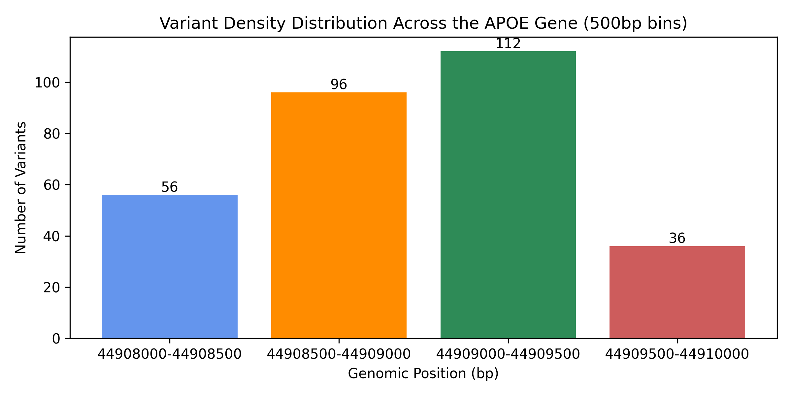
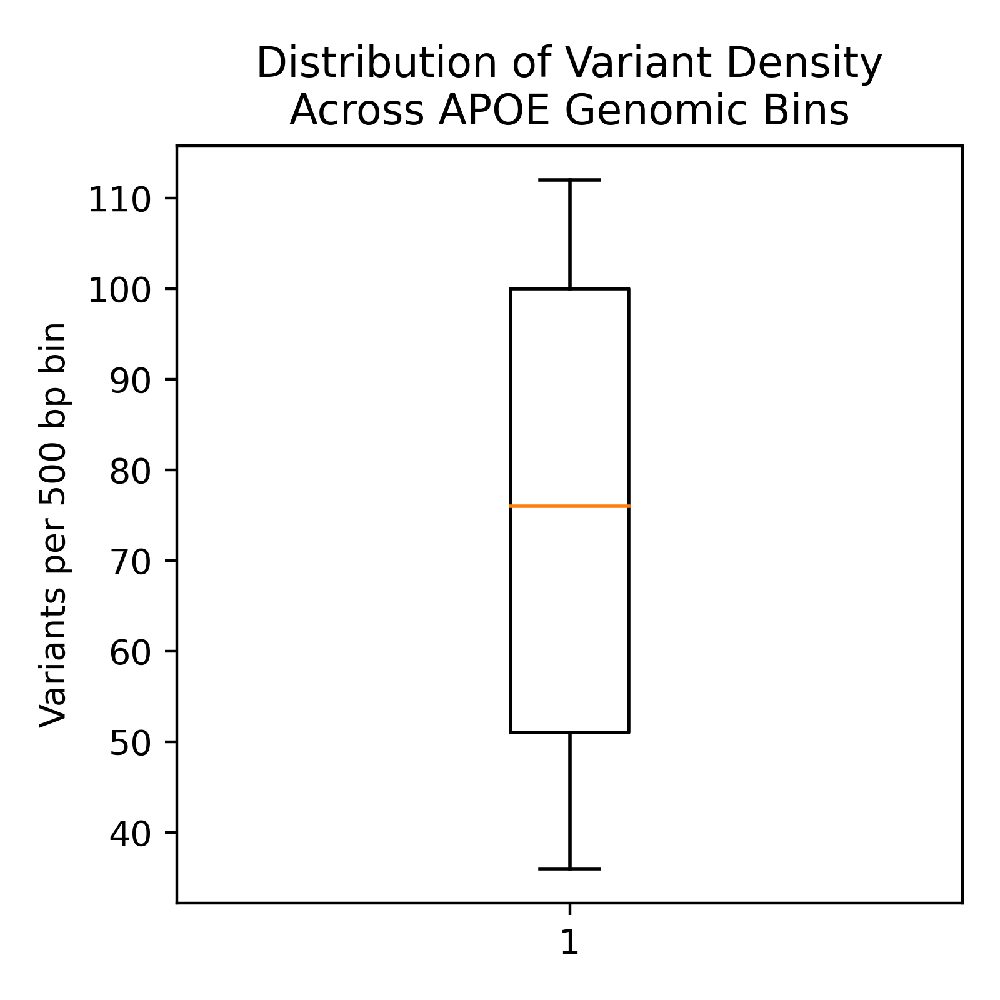

# RBIF100 Final Project: Bioinformatics Data Analysis & Visualization
### By: Helena Balbat

## Introduction
The apolipoprotein E (APOE) gene is one present in Homo sapiens, which was chosen as the gene of interest for this assignment. The APOE gene is responsible for making apolipoprotein E, a critical protein that transports fats and cholesterol. This protein is the main carrier of cholesterol for neurons in our brains, making the APOE gene an important topic of research. I found that variants of this gene can significantly alter the risk of developing late-onset Alzheimer's disease, which intrigued me to research variants in the Homo sapiens APOE gene at the nucleotide level. According to external research, APOE4 is the biggest genetic risk factor for Alzheimer's disease, possibly affecting amyloid plaque buildup and tau protein pathology, as well as causing inflammation in the brain (PubMed: https://pmc.ncbi.nlm.nih.gov/articles/PMC9644639/). For this project, a total of 300 variants were requested from NCBI using RESTful APIs. These were then input into a CSV file titled data.csv. This CSV file was then used to perform analyses of the data and to create visualizations of said analyses. The following report covers the findings and the interpretations of them. It aims to determine the makeup of variants across the APOE gene and the distribution of variant positioning across the APOE gene.

## Findings
Three analyses were intended to be performed on the collected dataset. These were (1) the classification of variant types, (2) the assessment of variant density across the APOE gene, and **(3) the analysis of nucleotide substitution patterns using transition/transversion ratios** (see note at the bottom of this report). After testing and further consideration, two major analyses were conducted, along with subsections for numerical/statistical analysis with NumPy and Pandas. Color was used to distinguish variant categories in Figure 1 and Figure 2. One additional figure (Figure 3) was created to further depict variant density analyses.

The first analysis determined the variant type distribution, meaning the makeup of the types of variants present amongst APOE genes. The three mutations include single nucleotide polymorphisms (SNPs), insertions, and deletions. Analysis 1A used a resusable function to count the number of each variant type across all records in the CSV file. Analysis 1B then used NumPy and Pandas to calculate the percentages that made up all of the records. Analysis 1A showed that there were 243 SNPs, 0 insertions, and 57 deletions amongst the 300 collected variant records.(Figure 1) Analysis 1B emphasized this, showing that SNPs made up 81.0% of all variants, and deletions made up the remaining 19.0%.

The second set of analyses covered variant density distribution in the APOE gene. Analysis 2A counted the number of variants across 500bp genomic bins in the APOE gene. It generated four bins, each being 500bp long. The first bin, base pairs 44909500-44910000, contained 36 variants. The second bin, base pairs 44909000-44909500, had 112 variants. The third bin, base pairs 44908500-44909000, had 96 variants. And the final bin, base pairs 44908000-44908500, had 56 variants. These bins were sorted in descending order.(Figure 2) Analysis 2B generates some basic statistics of variant positioning, those being the mean, minimum, and maximum positions (in bp). The mean position was 44908966bp. The minimum position was 44908036bp, and the maximum was 44909888bp. The last analysis, Analysis 2C, then quantifies variant clustering. The mean number of variants per bin was 75.0 variants. The variance in variant density (measured in variants per bin squared) was 923.0. Lastly, the standard deviation of variant density from the mean (measured in variants per bin) was 30.38, or approximately 30 variants.(Figure 3) 

A separate script was written to create an interactive visual with Plotly and Dash.(interactive_visualizations.py) This visual was a histogram of APOE variant density across genomic positions, covering the range of base pairs found in Analysis 2A. Rather than grouping variants into bins, this chart allows the reader to scroll their mouse over all of the bars and see the information about the variants in that range of positions. Each range had two bars, color-coded by variant type. Each bar displayed the variant type, genomic position, and count of variants in that area. The areas with the most reported variants were from (bp) 44.90805M - 44.9081M and (bp) 44.9084M - 44.9096M. The second range did have some dips, but the number of reported variants was higher in these areas. There were almost always fewer deletions than SNPs across each range, aside from (bp) 44.90875M - 44.9088M. In this range, there were five deletions, and only three SNPs reported. From (bp) 9081M - 90835M, there were only 0-2 variants counted in that entire range, all of them being SNPs. It drops off again after (bp) 44.9096M until (bp) 44.9099M. APOE is a relatively compact gene, so this range is only about 1900bp. The range can be confirmed using the minimum and maximum from Analysis 2B, resulting in 1852bp.

## Interpretations

In terms of Analyses 1A and 1B, it can be determined that mutations across the APOE gene are primarily SNPs, standing at 81.0%, or 243 variants.(Figure 1) This indicates that APOE is generally stable in terms of structural changes like insertions of deletions. The most variation in the APOE gene comes from single-nucleotide changes, meaning the gene is less likely to undergo significant sequence changes and, consequently, functional changes. Considering that this gene is important for lipid metabolism (cholesterol carrier) and neurological processes, it is critical that this gene is structually stable and less prone to insertions/deletions.

Using Analysis 2A, 2B, and 2C, it can be found that variants are clustered, not evenly spread across the gene. The lowest number of variants across the different bins in Analysis 2A is 36 variants in bin (bp) 44909500-44910000, while the highest number of variants in Analysis 2A is 112 variants in bin (bp) 44909000-44909500. These variant count numbers are not close together, indicating a large variance. This idea is confirmed in Analysis 2C, where the variance is 923.0 (variants per 500 bp bin ^2). There is substantial variation in how the variants are distributed across genomic bins in the APOE gene. These clusters also indicate that APOE variants are localized, not random. The peak region of variant densities is 44909000-44909500, meaning this region of the APOE gene is most likely important in terms of gene function. The standard deviation of variant density in Analysis 2C is 30.38, meaning that, on average, bin counts differ from the mean by about 30 variants. Figure 2 shows the large differences between variant counts across these four bins, agreeing with the findings from 2C. The variant distribution came out uneven meaning there are functionally important regions, most likely regulatory or exon-dense areas. Again, APOE is a somewhat compact gene, so many variants naturally fell into the four bins generated by the code, covering a total of 1892bp. Since the gene is compact, even small clusters of variants can significantly impact the gene's function if they fall in coding or regulatory regions. Low-density bins, or the variant-poor regions, likely encode critical protein domains and may contain regulatory elements. Mutations in these spots risk disrupting protein folding, altering lipid binding, or affecting receptor interactions. These areas need to be conserved, so there should be low counts of variants. In the high-density bins with many variants, the regions are more likely intronic or non-coding regions. These can tolerate neutral changes and are less critical to the structure of the APOE gene.

The interactive histogram (interactive_visualizations.py) mimics the findings from Analyses 2A-2C. The histogram provides a seamless transition of variant counts across the length of the APOE gene, but again shows the hotspots found in Analysis 2. The histogram does break the regions down into smaller segments, so there is more minute detail. It provides an even more accurate depiction of variant density distribution and clustering. The areas with low density found in the histogram ((bp) 9081M - 90835M, (bp) 44.9096M - 44.9099M)

## Conclusions and Workflow

## Figures

#### Figure 1. Variant Type Distribution Across the APOE Gene

#### Figure 2. Variant Density Across the APOE Gene

#### Figure 3. Variant Density Per Genomic Bin for the APOE Gene

**NOTE:** Transition/transversion analysis was not actively utilized because a large portion of dbSNP entries for APOE have identical reference and alternate alleles in the current reference assembly, making the calculation unreliable. The code has been included regardless, as it could be applied for a different set of variants, but it is apparent that all SNPs are counted as transversions for the APOE gene (even with 300 variants pulled). This resulted in a 0.0% transition/transversion ratio.

    # ANALYSIS 3: Transition Vs. Translation Ratio
        # Are APOE SNPs primarily transitions (A swaps with G / C swaps with T) or transversions (all other substitutions)?

    # define function tt_ratio and pass it variants
        # calculate the number of transitions and transversions among SNPs in the APOE gene
        # pass the list of dictionaries from step 1
        # return transition and transversion counts

    def tstv_ratio(variants):
        # set initial counts to 0
        transitions = 0
        transversions = 0

        # if the variant is an insertion or deletion (aka not a SNP) skip it
        for v in variants:
            if v["variant_type"] != "SNP":
                continue

            ref = v["reference_allele"].upper()
            alt = v["alternate_allele"].upper()

            # skip non-simple SNPs
            if len(ref) != 1 or len(alt) != 1:
                continue
            
            pair = {ref, alt}

            if pair in [{"A", "G"}, {"C", "T"}]:
                transitions += 1
            else:
                transversions += 1
        
        return transitions, transversions

    # run analysis 3
    ts, tv = tstv_ratio(variant_records)

    # final print statements
    print("\nTransition vs. Transversion Analysis:")
    print(f"Transitions: {ts}")
    print(f"Transversions: {tv}")
    print(f"Transition/Transversion Ratio: {ts / tv if tv > 0 else 'N/A'}")
